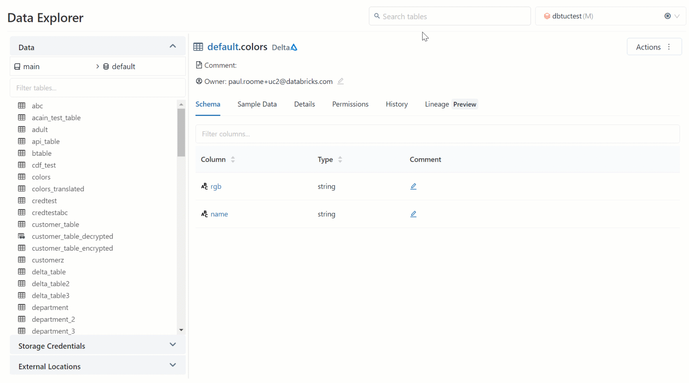
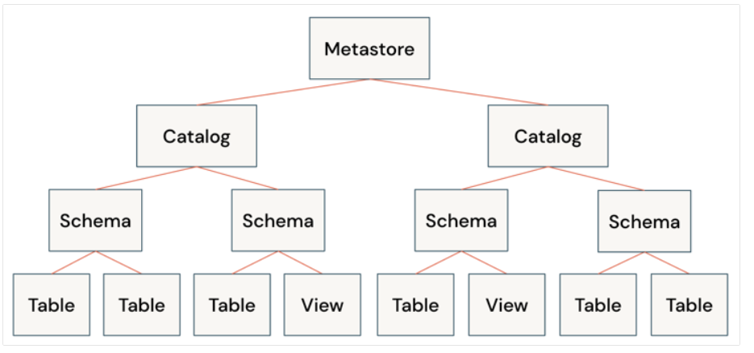
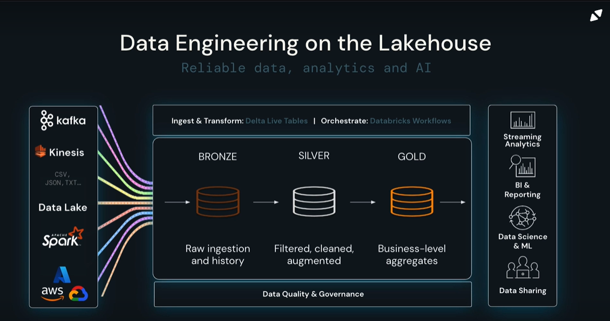

<table>
  <tr>
    <td></td>
    <td>Databricks Lakehouse Fundamentals - 2023-03-15</td>
  </tr>
 </table>

 

    What is a Data Lakehouse

 

A datalake house, also known as a lakehouse, is a modern data architecture that combines the best features of data lakes and data warehouses. It allows organizations to store and analyze both structured and unstructured data at scale, while providing features traditionally associated with data warehouses such as ACID transactions, schema enforcement, and query optimization. In other words, a datalake house is a unified platform for data engineering, data science, and analytics that is designed to be more reliable, performant, and cost-effective than traditional data management systems.

 

Benefits:

|                                |                                   |
| ------------------------------ | --------------------------------- |
| Transaction support            | Schema enforcement and governance |
| Data governance                | BI Support                        |
| Decouple storage from compute  | Open storage formats              |
| Support for diverse data types | Support for diverse workloads     |
| End-to-end streaming           |                                   |

 

    What is the Databricks Lakehouse Platform

 

- The first one in the cloud.
- Delta lake reliability and performance.
- Unify data warehouse and AI use cases.
- Simple, Open, Multicloud.
- Flexibility to share you data.

 

    Databricks Lakehouse Platform Architecture and Security Fundamentals

- Data Reliability and Performance

  > bad data in = bad data out
  >

  Traditional Data Lakes:

  > - Lack of ACID transaction support
  > - Lack schema enforce
  > - Lack of integration with a data Catalog.
  > - Too many small files.
  >

   

  The delta lake solves the problems from the traditional warehouse and add the following benefits:

  > - Audit historical and time travel
  >   - Easy rollback
  > - Unify streaming and batch data process
  > - The base are the delta tables
  >

  Photon

  > - It's a next generation query engine
  >   - Compatible with spark
  >   - 7x faster
  >   - Don't need changes from the spark code
  >

   
- Unified Governance and Security
  Unit Catalog:

  > - Common governance model based on ANSI SQL
  >   - Enforce fine grain access, column level
  >   - For any cloud, data and AI
  > - User interface for data search and discover
  > - Data lineage, data and column level
  >

   

  > 

   

  Delta Sharing

  > - Share live in parquet
  > - Centralize administration and governance
  > - Privacy face
  > - Rest protocol
  >
- Instant Compute and Serverless

  > - Run in databricks
  > - Only for SQL Server
  >
- Introduction to Lakehouse Data Management Terminology

  > 

    Supported Workloads on the Databricks Lakehouse Platform

- Supported Workload: Data warehousing
  > 
- Supported Workload: Data engineering
- Supported Workload: Data streaming
- Supported Workload: Data science and machine learning

 

### Goals

- Describe the origin and purpose of the data lakehouse and explain the challenges of managing and using big data.
- Describe fundamental concepts about the Databricks Lakehouse Platform, and explain how it solves big data challenges for data engineers, data analysts, and data scientists.
- Describe essential platform components and features essential to data reliability, performance and governance (Delta Lake, Photon, Unity Catalog, Delta Sharing, serverless compute).
- Define essential platform terminology (metastore, catalog, schema, table, view, and function).
- Explain the benefits of using the Databricks Lakehouse Platform for data warehousing, data engineering, data streaming, and data science and machine learning.

 

# References

1. [Exam details](https://www.databricks.com/learn/certification/lakehouse-platform-fundamentals)
