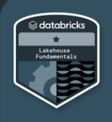

<table>
  <tr>
    <td></td>
    <td>Databricks Lakehouse Fundamentals</td>
  </tr>
 </table>

    What is a Data Lakehouse

...

    What is the Databricks Lakehouse Platform

...

    Databricks Lakehouse Platform Architecture and Security Fundamentals

- Data Reliability and Performance
Video
- Unified Governance and Security
Video
- Instant Compute and Serverless
- Introduction to Lakehouse Data Management Terminology

    Supported Workloads on the Databricks Lakehouse Platform

- Supported Workload: Data warehousing
- Supported Workload: Data engineering
- Supported Workload: Data streaming
- Supported Workload: Data science and machine learning

 

### Goals

- Describe the origin and purpose of the data lakehouse and explain the challenges of managing and using big data.

- Describe fundamental concepts about the Databricks Lakehouse Platform, and explain how it solves big data challenges for data engineers, data analysts, and data scientists. 

- Describe essential platform components and features essential to data reliability, performance and governance (Delta Lake, Photon, Unity Catalog, Delta Sharing, serverless compute).

- Define essential platform terminology (metastore, catalog, schema, table, view, and function).

- Explain the benefits of using the Databricks Lakehouse Platform for data warehousing, data engineering, data streaming, and data science and machine learning.

 

# References

1. [Exam details](https://www.databricks.com/learn/certification/lakehouse-platform-fundamentals)
